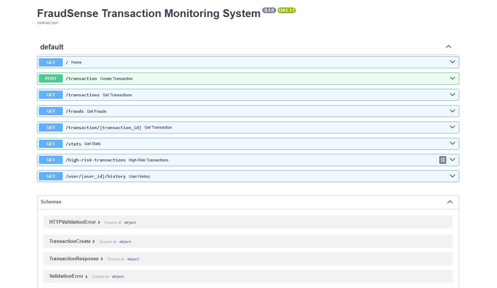
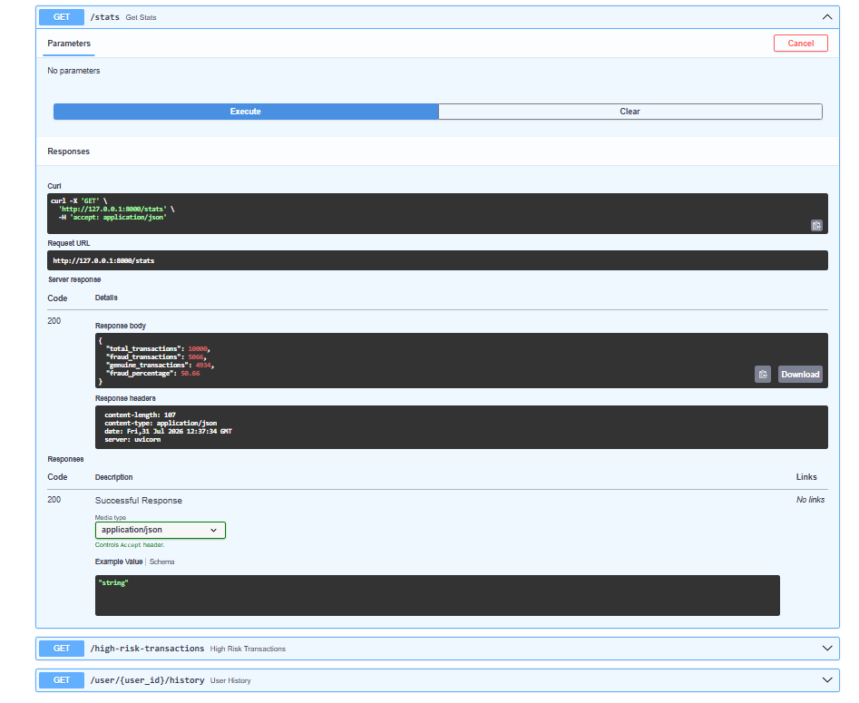
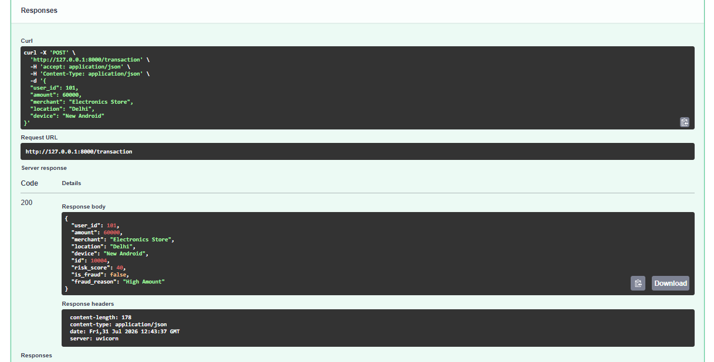
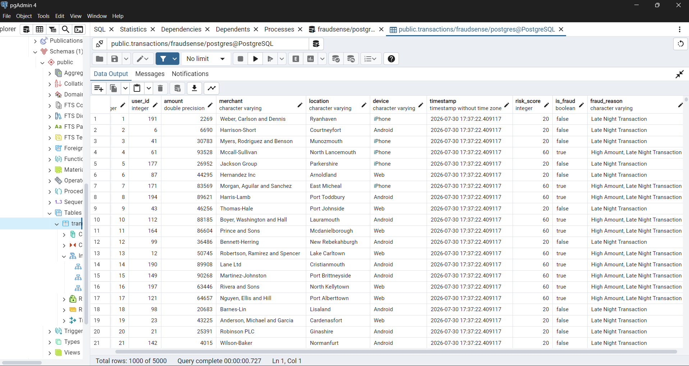

# FraudSense - Transaction Monitoring System

A rule-based transaction monitoring system built using **FastAPI**, **PostgreSQL**, and **SQLAlchemy** to detect potentially fraudulent financial transactions. The system evaluates each transaction using multiple risk factors such as transaction amount, frequency, temporal patterns, location changes, and device changes, then exposes REST APIs for monitoring and analysis.

---

## Features

- Rule-based fraud risk scoring
- Transaction monitoring using FastAPI
- PostgreSQL database integration
- SQLAlchemy ORM for database operations
- Detects:
  - High-value transactions
  - Frequent transactions
  - Late-night transactions
  - New device usage
  - New location changes
- Fraud reason generation
- REST APIs for transaction management and analytics
- Batch transaction insertion using SQLAlchemy
- Indexed PostgreSQL columns for faster querying

---

## Tech Stack

- Python
- FastAPI
- PostgreSQL
- SQLAlchemy
- Pydantic
- Faker
- Uvicorn

---

## Project Structure

```
FraudSense/
│── app.py
│── database.py
│── fraud_engine.py
│── models.py
│── schemas.py
│── seed_data.py
│── requirements.txt
│── README.md
│── .gitignore
```

---

## API Endpoints

| Method | Endpoint | Description |
|---------|----------|-------------|
| GET | `/` | Check API status |
| POST | `/transaction` | Create and analyze a transaction |
| GET | `/transactions` | Retrieve all transactions |
| GET | `/transaction/{id}` | Retrieve a transaction by ID |
| GET | `/frauds` | Retrieve all flagged transactions |
| GET | `/stats` | View transaction statistics |
| GET | `/high-risk-transactions` | Retrieve high-risk transactions |
| GET | `/user/{user_id}/history` | View transaction history of a user |

---

## Fraud Detection Rules

The system calculates a cumulative risk score based on:

- High transaction amount
- Transaction frequency within a short time window
- Late-night transaction activity
- New device detection
- New location detection

Transactions exceeding the configured threshold are flagged as potentially fraudulent.

---

## Performance Optimizations

- PostgreSQL indexing on frequently queried columns (`user_id`, `timestamp`)
- Batch insertion using SQLAlchemy `bulk_save_objects()`
- Efficient database querying using SQLAlchemy ORM

---
## Screenshots

### API Documentation



### Transaction Statistics



### Fraud Detection Response



### PostgreSQL Database



---

## Future Improvements

- Machine Learning-based fraud detection
- JWT authentication
- Role-based access control
- Real-time notifications
- Interactive dashboard
- Docker deployment

---

## Author

Developed by **Rithu Mithra**
